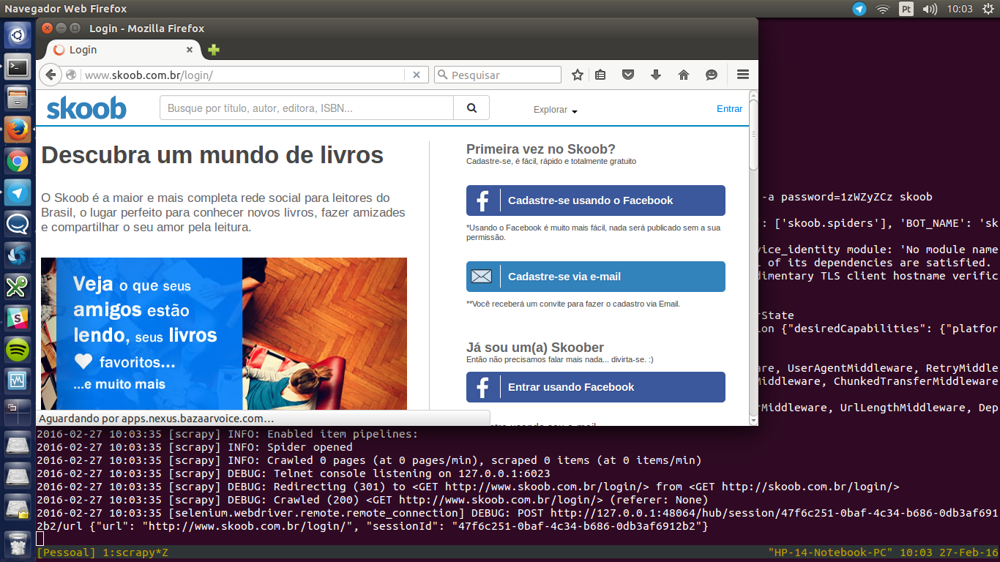

# skoober
> Extract user's data from Skoob.com.br



## Installation

```sh
pip install skoober 
```

## Usage example

To get the data from your Skoob bookshelve, on the skoob/ directory use the following command:

```sh
python skoober.py <skoob-user_id>
```

It'll generate a json file with all your books from Skoob

## Release History

* 0.4
    * Get data using Skoob's API
    * Drop Selenium and Scrapy
* 0.3.1
    * Bug fixes
* 0.3
    * First version using Selenium
* 0.0.1
    * Work in progress

## Meta

Guido Luz Percú – [@oumguido](https://twitter.com/oumguido)

Distributed under the MIT license. See ``LICENSE`` for more information.

[https://github.com/GuidoBR/skoober](https://github.com/GuidoBR/)
